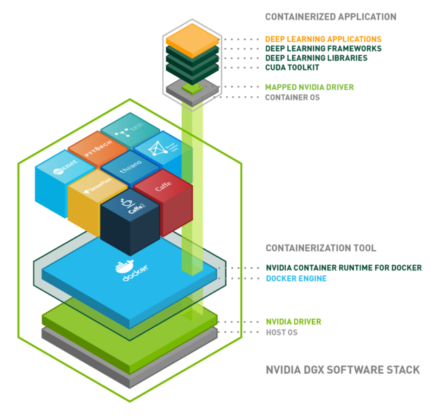

# GPU enablement


## 1 GPU enablement on linux host


An application running on linux is built upon:
- CUDA driver (kernel mode driver + user mode driver)
- CUDA toolkit 
- other Libs/frameworks to build applications

## 2. GPU enablement on container
 

An application running in container is built upon:
- available GPU device on container host is allocated to a container 
- driver (kernel mode driver + user mode driver) on container host is mapped/mounted to container 
- container then has a GPU device and can use this device via the mapped driver (kernel mode driver + user mode driver)
- use can build their application based on different cuda images (https://catalog.ngc.nvidia.com/orgs/nvidia/containers/cuda/tags?filters=&orderBy=weightPopularDESC&query=&page=&pageSize=) with cuda toolkit and libs they want

## 3. How to expose GPU to a VM (container host) from ESX
### 3.1 Passthrough

## 3.2 vGPU


## 4. GPU on kubernetes


- kubernetes platform operator should expose GPU or vGPU to worker VM
- GPU operator ([repo](https://github.com/NVIDIA/gpu-operator)) is responsible to manage the lifecycle of GPUs when GPU is used with Kubernetes at a Cluster level 
  - nvidia-driver installs NVIDIA AI Enterprise Driver ([repo](https://gitlab.com/nvidia/container-images/driver))
  - nvdia-device-plugin exposes the number of GPUs on each nodes and allocate/requese GPU to any requesting GPU containers ([repo](https://github.com/NVIDIA/k8s-device-plugin))
  - nvidia-container-toolkit([repo](https://gitlab.com/nvidia/container-toolkit/container-toolkit)) installs nvidia container runtime and modifies container runtime config file to expose driver to container during container lifecyle, leveraging libnvdia-container ([repo](https://github.com/NVIDIA/libnvidia-container))
  
### 4.1 gpu operator installation  
```
helm repo add nvidia https://helm.ngc.nvidia.com/nvidia \
    && helm repo update
 
helm install --wait --generate-name \
 -n gpu-operator --create-namespace \
 nvidia/gpu-operator \
   --set toolkit.env[0].name=CONTAINERD_CONFIG \
   --set toolkit.env[0].value=<your containerd config folder>/config.toml \
   --set toolkit.env[1].name=CONTAINERD_SOCKET \
   --set toolkit.env[1].value=<your containerd sock folder>/containerd.sock \
   --set toolkit.env[2].name=CONTAINERD_RUNTIME_CLASS \
   --set toolkit.env[2].value=nvidia \
   --set toolkit.env[3].name=CONTAINERD_SET_AS_DEFAULT \
   --set-string toolkit.env[3].value="true"
```
### 4.2 Details
(to be completed)

### 4.3 Sample workload
```
~$ cat yike/tf-notebook.yaml
---
apiVersion: v1
kind: Service
metadata:
  name: tf-notebook
  labels:
    app: tf-notebook
spec:
  type: NodePort
  ports:
  - port: 80
    name: http
    targetPort: 8888
    nodePort: 30001
  selector:
    app: tf-notebook
---
apiVersion: v1
kind: Pod
metadata:
  name: tf-notebook
  labels:
    app: tf-notebook
spec:
  securityContext:
    fsGroup: 0
  containers:
  - name: tf-notebook
    image: tensorflow:latest-gpu-jupyter
    resources:
      limits:
        nvidia.com/gpu: 1
    ports:
    - containerPort: 8888
      name: notebook
```

```
~$ cat gpu-accelerated.yaml
apiVersion: batch/v1
kind: Job
metadata:
  labels:
    app: samples-tf-mnist-demo
  name: samples-tf-mnist-demo
spec:
  template:
    metadata:
      labels:
        app: samples-tf-mnist-demo
    spec:
      containers:
      - name: samples-tf-mnist-demo
        image: mcr.microsoft.com/azuredocs/samples-tf-mnist-demo:gpu
        args: ["--max_steps", "500"]
        imagePullPolicy: IfNotPresent
        volumeMounts:
          - mountPath: /tmp
            name: scratch
        resources:
          limits:
            nvidia.com/gpu: 1
      restartPolicy: OnFailure
      tolerations:
      - key: "sku"
        operator: "Equal"
        value: "gpu"
        effect: "NoSchedule"
      volumes:
        - name: scratch
          hostPath:
            # directory location on host
            path: /mnt/tmp
            type: DirectoryOrCreate
            # this field is optional
```

```
~$ cat gpu-test.yaml
apiVersion: apps/v1
kind: Deployment
metadata:
  creationTimestamp: null
  labels:
    run: gpu-test
  name: gpu-test
spec:
  replicas: 1
  selector:
    matchLabels:
      run: gpu-test
  template:
    metadata:
      labels:
        run: gpu-test
    spec:
      containers:
      - command:
        - sh
        - -c
        - "deviceQuery && sleep infinity"
        image: kshatrix/gpu-example:cuda-10.2
        name: gpu-test
        resources:
          limits:
            nvidia.com/gpu: "1"
```

# 5. Problems hit

## 5.1 numa node

I notice a warning message `successful NUMA node read from SysFS had negative value (-1), but there must be at least one NUMA node, so returning NUMA node zero` reported in my application. Hence I did an investigation
- https://gist.github.com/zrruziev/b93e1292bf2ee39284f834ec7397ee9f
- https://stackoverflow.com/questions/44232898/memoryerror-in-tensorflow-and-successful-numa-node-read-from-sysfs-had-negativ
Re-correct the NUMA node settings according to above reference.

Go deeper about why numa_node=-1:

This is the explanation on the -1 value. https://github.com/torvalds/linux/blob/v6.0/Documentation/ABI/testing/sysfs-bus-pci#L344-L355 says
```
This file contains the NUMA node to which the PCI device is attached, or -1 if the node is unknown.  The initial value comes from an ACPI _PXM method or a similar firmware source.  If that is missing or incorrect, this file can be written to override the node. In that case, please report a firmware bug to the system vendor.
```

I search for _PXM method, it says "The _PXM method is typically defined in the ACPI tables provided by the system's firmware (BIOS or UEFI)".

Finally, it turns out that when creating virtual machine, we need to set  `chipset.motherboardLayout = "acpi"` to let vNuma on VM work.

## 5.2 tf-notebook service fails to connect to ipkernel

With the problem, I cannot run code from UI.
After debugging,  I found we need to access UI via proxy. The proxy is somewhat not configured well and it will drop packets. Hence from UI, we cannot get the running result pushed back. After accessing the UI not through a proxy, the UI service works fine now.


# 6. Build CUDA application yourself
Base image: https://catalog.ngc.nvidia.com/orgs/nvidia/containers/cuda

- base: Includes the CUDA runtime (cudart)
- runtime: Builds on the base and includes the CUDA math libraries, and NCCL. A runtime image that also includes cuDNN is available. 
- devel: Builds on the runtime and includes headers, development tools for building CUDA images. These images are particularly useful for multi-stage builds.


# Reference
1. https://developer.nvidia.com/blog/gpu-containers-runtime/
2. official diagrams from official nvidia website
   
   
