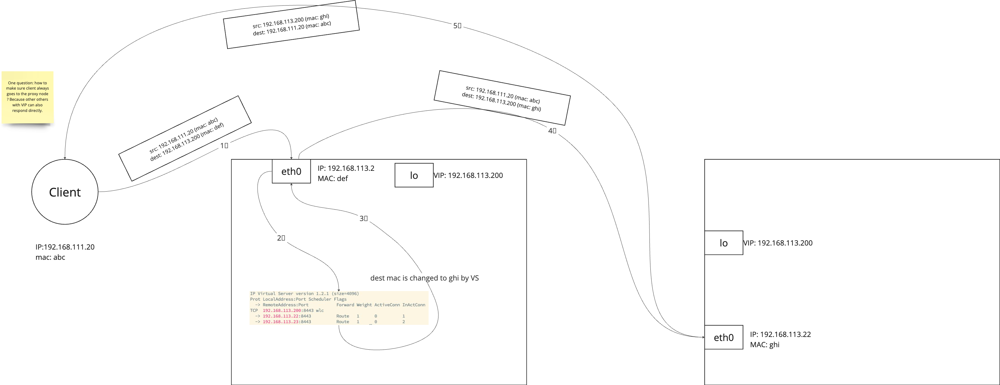
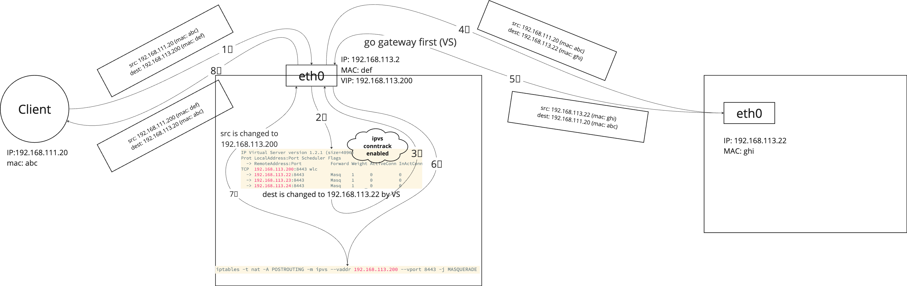

# kube-vip

kube-vip runs as a daemon on a kuberentes node.

Each kube-vip replica is responsible for setting VIP, IPVS and BGP instance

## 1. control plane LB

### 1.1 arp


### 1.2 bgp


## 2. service LB

### 2.1 arp


### 2.2 bgp


## 3. IPVS
### 3.1 Packet Forwarding method
https://www.alibabacloud.com/blog/load-balancing---linux-virtual-server-lvs-and-its-forwarding-modes_595724
#### 3.1.1 Direct Routing
```
# 1. create ipvs 
master/0:~# ipvsadm -A -t 192.168.113.200:8443
master/0:~# ipvsadm -a -t 192.168.113.200:8443 -r 192.168.113.22:8443 -g
master/0:~# ipvsadm -a -t 192.168.113.200:8443 -r 192.168.113.23:8443 -g
master/0:~# ipvsadm -a -t 192.168.113.200:8443 -r 192.168.113.24:8443 -g
master/0:~# ipvsadm -L -n
IP Virtual Server version 1.2.1 (size=4096)
Prot LocalAddress:Port Scheduler Flags
  -> RemoteAddress:Port           Forward Weight ActiveConn InActConn
TCP  192.168.113.200:8443 wlc
  -> 192.168.113.22:8443          Route   1      0          0        
  -> 192.168.113.23:8443          Route   1      0          0        
  -> 192.168.113.24:8443          Route   1      0          0
 
 
# 2.set VIP to each masters(BS) via `ip addr add 192.168.113.200/32 dev lo`
 
# 3. test from client
jumper:~$ curl https://192.168.113.200:8443 -sk
{
  "kind": "Status",
  "apiVersion": "v1",
  "metadata": {},
  "status": "Failure",
  "message": "forbidden: User \"system:anonymous\" cannot get path \"/\"",
  "reason": "Forbidden",
  "details": {},
  "code": 403
}
 
# 4. check connections
master/0:~# ipvsadm -L -n
IP Virtual Server version 1.2.1 (size=4096)
Prot LocalAddress:Port Scheduler Flags
  -> RemoteAddress:Port           Forward Weight ActiveConn InActConn
TCP  192.168.113.200:8443 wlc
  -> 192.168.113.22:8443          Route   1      0          1        
  -> 192.168.113.23:8443          Route   1      0          1        
  -> 192.168.113.24:8443          Route   1      0          1
```




#### 3.1.2 NAT mode

```
# create ipvs on the proxy node
# 1. set VIP
ip addr add 192.168.113.200/32 dev eth0
# 2. set IPVS
ipvsadm -A -t 192.168.113.200:8443
ipvsadm -a -t 192.168.113.200:8443 -r 192.168.113.22:6443 -m
ipvsadm -a -t 192.168.113.200:8443 -r 192.168.113.23:6443 -m
ipvsadm -a -t 192.168.113.200:8443 -r 192.168.113.24:6443 -m
iptables -t nat -A POSTROUTING -m ipvs --vaddr 192.168.113.200 --vport 8443 -j MASQUERADE
echo 1 >  /proc/sys/net/ipv4/vs/conntrack
echo 1 > /proc/sys/net/ipv4/ip_forward
```

see different api server responding
```
jumper:~/kube-vip$ kubectl get pod
No resources found in default namespace.
jumper:~/kube-vip$  date -u
Mon Apr  8 02:45:09 AM UTC 2024
jumper:~/kube-vip$ kubectl get pod
No resources found in default namespace.
jumper:~/kube-vip$ date -u
Mon Apr  8 02:47:37 AM UTC 2024
jumper:~/kube-vip$ kubectl get pod
No resources found in default namespace.
jumper:~/kube-vip$ date -u
Mon Apr  8 02:48:43 AM UTC 2024
 
master/0:/var/log# grep -rn "/api/v1/namespaces/default/pods?limit=500" .
./kube-apiserver/audit/log/audit.log:13417:{"kind":"Event","apiVersion":"audit.k8s.io/v1","level":"Request","auditID":"527a905d-11be-49be-b5e5-8d3782755303","stage":"ResponseComplete","requestURI":"/api/v1/namespaces/default/pods?limit=500","verb":"list","user":{"username":"system:serviceaccount:default:2d5f17d7-d213-4cba-9a7d-17a04ce8fcab","uid":"0e8cb972-08bc-4fc0-bc57-69c4f491a9c5","groups":["system:serviceaccounts","system:serviceaccounts:default","system:authenticated"]},"sourceIPs":["30.1.2.5"],"userAgent":"kubectl/v1.28.5 (linux/amd64) kubernetes/506050d","objectRef":{"resource":"pods","namespace":"default","apiVersion":"v1"},"responseStatus":{"metadata":{},"code":200},"requestReceivedTimestamp":"2024-04-08T02:45:08.234193Z","stageTimestamp":"2024-04-08T02:45:08.246530Z","annotations":{"authentication.k8s.io/legacy-token":"system:serviceaccount:default:2d5f17d7-d213-4cba-9a7d-17a04ce8fcab","authorization.k8s.io/decision":"allow","authorization.k8s.io/reason":"RBAC: allowed by ClusterRoleBinding \"pks:2d5f17d7-d213-4cba-9a7d-17a04ce8fcab-cluster-admin\" of ClusterRole \"cluster-admin\" to ServiceAccount \"2d5f17d7-d213-4cba-9a7d-17a04ce8fcab/default\""}}
 
master/0:/var/log# grep -rn "/api/v1/namespaces/default/pods?limit=500" .
./kube-apiserver/audit/log/audit.log:21426:{"kind":"Event","apiVersion":"audit.k8s.io/v1","level":"Request","auditID":"1f98ce2a-186e-42f8-952e-6d97d0034445","stage":"ResponseComplete","requestURI":"/api/v1/namespaces/default/pods?limit=500","verb":"list","user":{"username":"system:serviceaccount:default:2d5f17d7-d213-4cba-9a7d-17a04ce8fcab","uid":"0e8cb972-08bc-4fc0-bc57-69c4f491a9c5","groups":["system:serviceaccounts","system:serviceaccounts:default","system:authenticated"]},"sourceIPs":["30.1.2.5"],"userAgent":"kubectl/v1.28.5 (linux/amd64) kubernetes/506050d","objectRef":{"resource":"pods","namespace":"default","apiVersion":"v1"},"responseStatus":{"metadata":{},"code":200},"requestReceivedTimestamp":"2024-04-08T02:47:33.597552Z","stageTimestamp":"2024-04-08T02:47:33.608917Z","annotations":{"authentication.k8s.io/legacy-token":"system:serviceaccount:default:2d5f17d7-d213-4cba-9a7d-17a04ce8fcab","authorization.k8s.io/decision":"allow","authorization.k8s.io/reason":"RBAC: allowed by ClusterRoleBinding \"pks:2d5f17d7-d213-4cba-9a7d-17a04ce8fcab-cluster-admin\" of ClusterRole \"cluster-admin\" to ServiceAccount \"2d5f17d7-d213-4cba-9a7d-17a04ce8fcab/default\""}}
 
master/0:/var/log# grep -rn "/api/v1/namespaces/default/pods?limit=500" .
./kube-apiserver/audit/log/audit.log:95815:{"kind":"Event","apiVersion":"audit.k8s.io/v1","level":"Request","auditID":"04add087-8d54-4e3c-86e2-edd8e9a41d15","stage":"ResponseComplete","requestURI":"/api/v1/namespaces/default/pods?limit=500","verb":"list","user":{"username":"system:serviceaccount:default:2d5f17d7-d213-4cba-9a7d-17a04ce8fcab","uid":"0e8cb972-08bc-4fc0-bc57-69c4f491a9c5","groups":["system:serviceaccounts","system:serviceaccounts:default","system:authenticated"]},"sourceIPs":["30.1.2.5"],"userAgent":"kubectl/v1.28.5 (linux/amd64) kubernetes/506050d","objectRef":{"resource":"pods","namespace":"default","apiVersion":"v1"},"responseStatus":{"metadata":{},"code":200},"requestReceivedTimestamp":"2024-04-08T02:48:41.759867Z","stageTimestamp":"2024-04-08T02:48:41.777685Z","annotations":{"authentication.k8s.io/legacy-token":"system:serviceaccount:default:2d5f17d7-d213-4cba-9a7d-17a04ce8fcab","authorization.k8s.io/decision":"allow","authorization.k8s.io/reason":"RBAC: allowed by ClusterRoleBinding \"pks:2d5f17d7-d213-4cba-9a7d-17a04ce8fcab-cluster-admin\" of ClusterRole \"cluster-admin\" to ServiceAccount \"2d5f17d7-d213-4cba-9a7d-17a04ce8fcab/default\""}}
```



reference:
- https://medium.com/google-cloud/load-balancing-with-ipvs-1c0a48476c4d
- https://gist.github.com/3Hren/0ad6321693f1114dc3af5f13481b8db3

### 3.1.3 Local mode
N/A
(It's a mode that seems only directing to current node)


Notes:
The proxy node (which has the virtual server) in NAT and DR mode is not required to be one of the backend server.