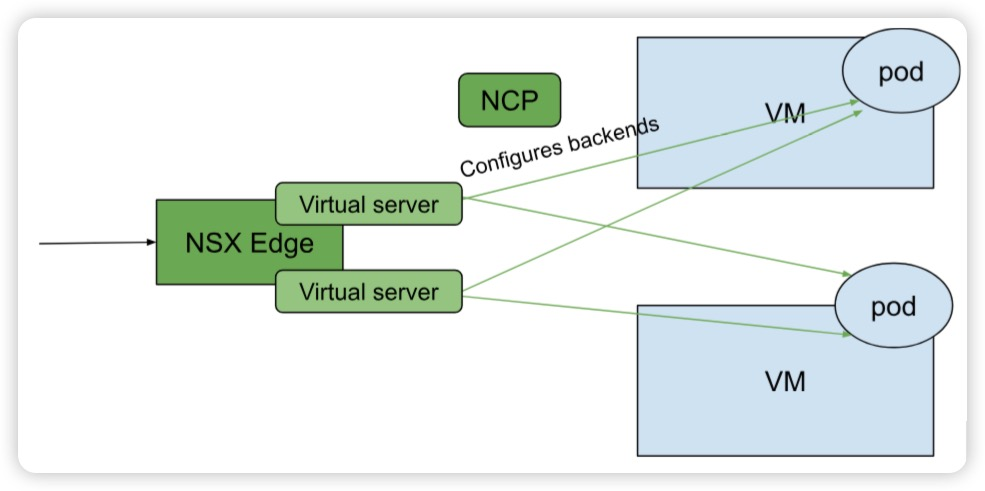
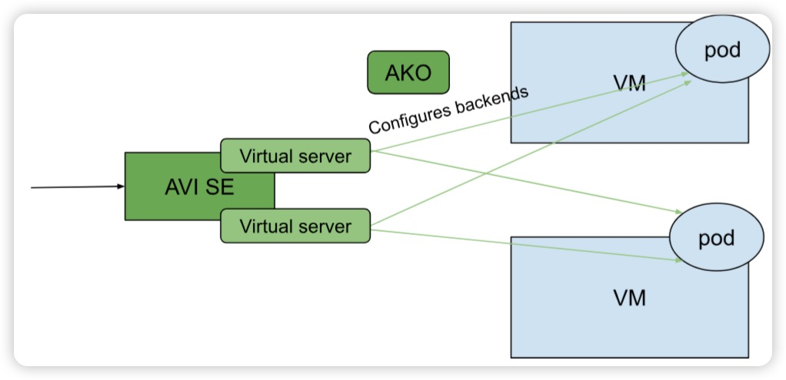
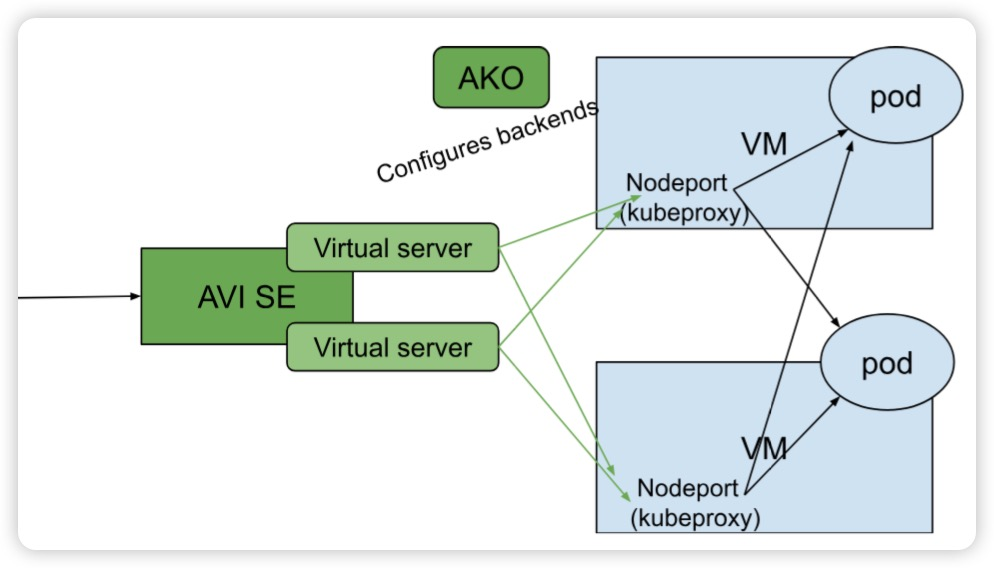
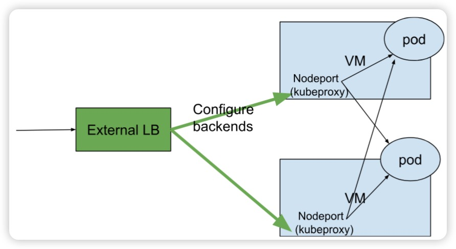

# Access a kubernetes service via load balancer

## 1. Built in LB

Expose VIP inside backend VMs and use network basis (ARP/BGP) to receive outside traffic to different node and then leverage kubeproxy to direct to different pod

- Antrea LB
- Metal LB
- Kube-VIP

Providing a separate ip range as VIPs is necessary for this solution, as well as the 2nd external LB solution

Built-in LB is usually easy to install and light to maintain. 

### Cons
- User needs to arrange VIP network and node network properly in advance

### Pros
- Light tech solution
- Quite simple, no more component is required to install
- Satisfy the basic LB service functionality

## 2. External LB solution
- External LB uses network virtualization to serve as multiple virtual servers
- Virtual server(External LB) to load balance to 
  - different node, then the kube proxy load balance traffic to different pod
  - Or to different pod directly (routable to pod)
- A component dynamically notifies and configures nodes or pods to corresponding virtual server (external LB)

### 2.1 NSX edge + NCP

### 2.2 AVI service engine + AKO

### Cons
- Too heavy to install and configure
- Too costly to adopt a complete LB solution

### Pros
- Production readiness with rich LB related features

## 3. Build a LB solution ourselves

- deploy an external LB  
- configure backend VMs ourselves to the external LB
- Kubeproxy is leveraged to relay traffic to pods

Options of external LB: haproxy, etc.

### Cons
- Since there is no controller to automatically attach/maintain backend nodes and node port to haproxy, something has to do this work, per kubernetes cluster creation, resize and deletion, even node failure etc.
- LB functionality is self-maintained
- One haproxy only works for one LB service

### Pros
- No additional manual network configuration from user

